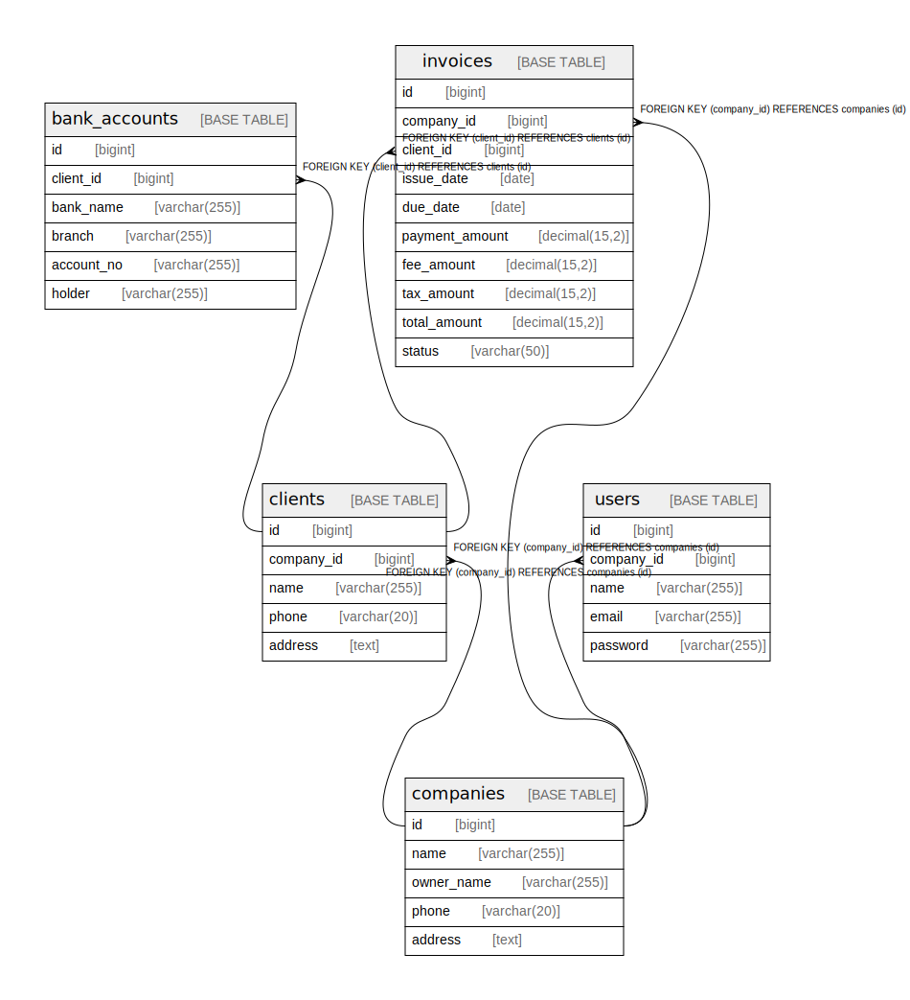

# uct

## Tables

| Name | Columns | Comment | Type |
| ---- | ------- | ------- | ---- |
| [bank_accounts](bank_accounts.md) | 6 |  | BASE TABLE |
| [clients](clients.md) | 5 |  | BASE TABLE |
| [companies](companies.md) | 5 |  | BASE TABLE |
| [invoices](invoices.md) | 10 |  | BASE TABLE |
| [users](users.md) | 5 |  | BASE TABLE |

## Relations

---

> Generated by [tbls](https://github.com/k1LoW/tbls)
