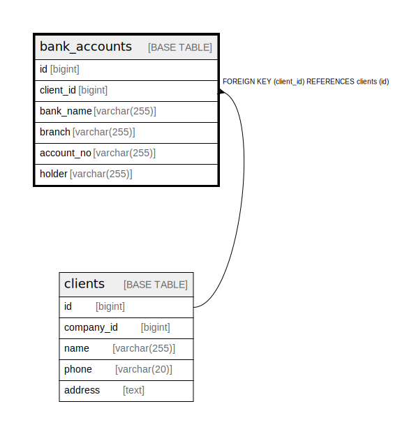

# bank_accounts

## Description

<details>
<summary><strong>Table Definition</strong></summary>

```sql
CREATE TABLE `bank_accounts` (
  `id` bigint NOT NULL AUTO_INCREMENT,
  `client_id` bigint NOT NULL,
  `bank_name` varchar(255) COLLATE utf8mb4_unicode_ci NOT NULL,
  `branch` varchar(255) COLLATE utf8mb4_unicode_ci NOT NULL,
  `account_no` varchar(255) COLLATE utf8mb4_unicode_ci NOT NULL,
  `holder` varchar(255) COLLATE utf8mb4_unicode_ci NOT NULL,
  PRIMARY KEY (`id`),
  KEY `client_id` (`client_id`),
  CONSTRAINT `bank_accounts_ibfk_1` FOREIGN KEY (`client_id`) REFERENCES `clients` (`id`) ON DELETE CASCADE
) ENGINE=InnoDB DEFAULT CHARSET=utf8mb4 COLLATE=utf8mb4_unicode_ci
```

</details>

## Columns

| Name | Type | Default | Nullable | Extra Definition | Children | Parents | Comment |
| ---- | ---- | ------- | -------- | ---------------- | -------- | ------- | ------- |
| id | bigint |  | false | auto_increment |  |  |  |
| client_id | bigint |  | false |  |  | [clients](clients.md) |  |
| bank_name | varchar(255) |  | false |  |  |  |  |
| branch | varchar(255) |  | false |  |  |  |  |
| account_no | varchar(255) |  | false |  |  |  |  |
| holder | varchar(255) |  | false |  |  |  |  |

## Constraints

| Name | Type | Definition |
| ---- | ---- | ---------- |
| bank_accounts_ibfk_1 | FOREIGN KEY | FOREIGN KEY (client_id) REFERENCES clients (id) |
| PRIMARY | PRIMARY KEY | PRIMARY KEY (id) |

## Indexes

| Name | Definition |
| ---- | ---------- |
| client_id | KEY client_id (client_id) USING BTREE |
| PRIMARY | PRIMARY KEY (id) USING BTREE |

## Relations



---

> Generated by [tbls](https://github.com/k1LoW/tbls)
