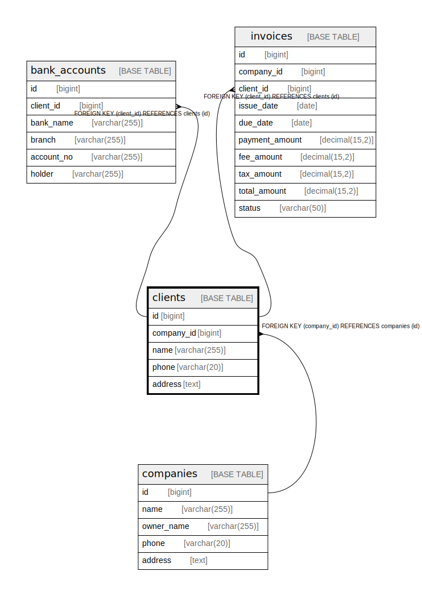

# clients

## Description

<details>
<summary><strong>Table Definition</strong></summary>

```sql
CREATE TABLE `clients` (
  `id` bigint NOT NULL AUTO_INCREMENT,
  `company_id` bigint NOT NULL,
  `name` varchar(255) COLLATE utf8mb4_unicode_ci NOT NULL,
  `phone` varchar(20) COLLATE utf8mb4_unicode_ci DEFAULT NULL,
  `address` text COLLATE utf8mb4_unicode_ci,
  PRIMARY KEY (`id`),
  KEY `company_id` (`company_id`),
  CONSTRAINT `clients_ibfk_1` FOREIGN KEY (`company_id`) REFERENCES `companies` (`id`) ON DELETE CASCADE
) ENGINE=InnoDB DEFAULT CHARSET=utf8mb4 COLLATE=utf8mb4_unicode_ci
```

</details>

## Columns

| Name | Type | Default | Nullable | Extra Definition | Children | Parents | Comment |
| ---- | ---- | ------- | -------- | ---------------- | -------- | ------- | ------- |
| id | bigint |  | false | auto_increment | [bank_accounts](bank_accounts.md) [invoices](invoices.md) |  |  |
| company_id | bigint |  | false |  |  | [companies](companies.md) |  |
| name | varchar(255) |  | false |  |  |  |  |
| phone | varchar(20) |  | true |  |  |  |  |
| address | text |  | true |  |  |  |  |

## Constraints

| Name | Type | Definition |
| ---- | ---- | ---------- |
| clients_ibfk_1 | FOREIGN KEY | FOREIGN KEY (company_id) REFERENCES companies (id) |
| PRIMARY | PRIMARY KEY | PRIMARY KEY (id) |

## Indexes

| Name | Definition |
| ---- | ---------- |
| company_id | KEY company_id (company_id) USING BTREE |
| PRIMARY | PRIMARY KEY (id) USING BTREE |

## Relations



---

> Generated by [tbls](https://github.com/k1LoW/tbls)
